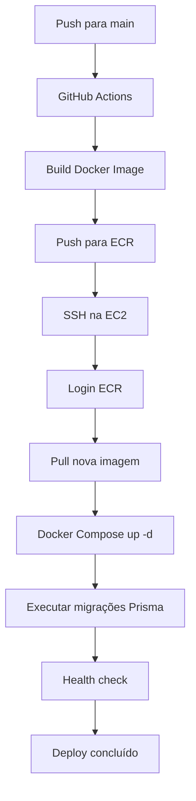

# Nova Arquitetura CI/CD: Docker + SSH na AWS EC2

## Visão Geral

Esta especificação descreve a migração do fluxo de deploy atual (CodeDeploy + tar.gz + Node/pnpm local na EC2) para um modelo baseado em containers Docker com deploy via SSH direto.

### Problemas do Modelo Atual

1. **Falhas frequentes de symlinks pnpm** durante extração do tar.gz
2. **Erros TTY** (`[ERR_PNPM_ABORTED_REMOVE_MODULES_DIR_NO_TTY]`)
3. **Complexidade** com múltiplos agentes (CodeDeploy, PM2, NVM)
4. **Dependências locais** na EC2 (Node, pnpm, Prisma)

### Solução Proposta

1. **Build imutável:** Imagem Docker construída no GitHub Actions
2. **Registry central:** AWS ECR para versionamento de imagens
3. **Deploy simplificado:** SSH direto na EC2 para pull + restart
4. **Runtime isolado:** Containers Docker encapsulam todas as dependências

---

## Fluxo de Deploy



---

## Arquitetura de Arquivos

### 1. Configuração Next.js (`apps/app/next.config.js`)

```javascript
// @ts-check

/**
 * @type {import('next').NextConfig}
 **/
const nextConfig = {
  output: 'standalone', // ← NOVO: gera build otimizado para Docker
  serverExternalPackages: ['@aws-sdk/client-s3', '@aws-sdk/core'],
};

module.exports = nextConfig;
```

### 2. Dockerfile (raiz do projeto)

```dockerfile
# Estágio 1: Builder
FROM node:22-alpine AS builder

# Instala pnpm globalmente
RUN npm install -g pnpm@10

# Copia arquivos de lock e workspace para otimizar cache
COPY pnpm-lock.yaml pnpm-workspace.yaml package.json ./
COPY apps/app/package.json ./apps/app/package.json

# Instala dependências
RUN pnpm install --frozen-lockfile

# Copia código fonte
COPY . .

# Build da aplicação
RUN npx nx build app

# Estágio 2: Runner
FROM node:22-alpine AS runner

ENV NODE_ENV=production

# Cria usuário não-root
RUN addgroup --system --gid 1001 nodejs
RUN adduser --system --uid 1001 nextjs

# Copia artefatos standalone do Next.js
COPY --from=builder --chown=nextjs:nodejs /home/node/apps/app/.next/standalone /app
COPY --from=builder --chown=nextjs:nodejs /home/node/apps/app/.next/static /app/.next/static
COPY --from=builder --chown=nextjs:nodejs /home/node/apps/app/public /app/public

USER nextjs

EXPOSE 3000

ENV PORT=3000
ENV HOSTNAME="0.0.0.0"

CMD ["node", "/app/server.js"]
```

### 3. Docker Compose para Produção (`docker/docker-compose.yml`)

```yaml
version: '3.8'

services:
  db:
    image: postgres:15-alpine
    restart: always
    environment:
      POSTGRES_USER: postgres
      POSTGRES_PASSWORD: password
      POSTGRES_DB: devxp
    ports:
      - '5432:5432'
    volumes:
      - devxp_data:/var/lib/postgresql/data

  app:
    image: ${AWS_ACCOUNT_ID}.dkr.ecr.${AWS_REGION:-us-east-1}.amazonaws.com/devxp-app:latest
    restart: always
    depends_on:
      - db
    ports:
      - '3000:3000'
    env_file:
      - /home/ec2-user/meu-app/apps/app/.env
    volumes:
      - /home/ec2-user/meu-app/prisma:/app/prisma:ro

volumes:
  devxp_data:
    name: docker_devxp_data
```

### 4. Pipeline GitHub Actions (`.github/workflows/deploy.yml`)

```yaml
name: CI/CD Pipeline - Docker + SSH

on:
  push:
    branches:
      - main

jobs:
  build-and-deploy:
    runs-on: ubuntu-latest
    environment: staging
    permissions:
      id-token: write
      contents: read

    steps:
      - name: Checkout Code
        uses: actions/checkout@v4

      - name: Setup pnpm
        uses: pnpm/action-setup@v4
        with:
          version: 10

      - name: Setup Node.js
        uses: actions/setup-node@v4
        with:
          node-version: '22'
          cache: 'pnpm'

      - name: Install Dependencies
        run: pnpm install --frozen-lockfile

      - name: Generate Prisma Client
        run: pnpm prisma generate

      - name: Build Application
        run: pnpm nx build app

      - name: Configure AWS Credentials
        uses: aws-actions/configure-aws-credentials@v4
        with:
          role-to-assume: ${{ vars.AWS_ROLE_ARN }}
          aws-region: ${{ vars.AWS_REGION }}

      - name: Login to Amazon ECR
        id: login-ecr
        uses: aws-actions/amazon-ecr-login@v2

      - name: Build and Push Docker Image
        env:
          REGISTRY: ${{ steps.login-ecr.outputs.registry }}
          REPOSITORY: devxp-app
          IMAGE_TAG: ${{ github.sha }}
        run: |
          docker build -t $REGISTRY/$REPOSITORY:$IMAGE_TAG -t $REGISTRY/$REPOSITORY:latest .
          docker push $REGISTRY/$REPOSITORY:$IMAGE_TAG
          docker push $REGISTRY/$REPOSITORY:latest

      - name: Deploy via SSH
        uses: appleboy/ssh-action@master
        with:
          host: ${{ secrets.EC2_HOST }}
          username: ec2-user
          key: ${{ secrets.EC2_SSH_KEY }}
          script: |
            cd /home/ec2-user/meu-app

            # Login no ECR
            aws ecr get-login-password --region ${{ vars.AWS_REGION }} | \
              docker login --username AWS --password-stdin ${{ vars.AWS_ACCOUNT_ID }}.dkr.ecr.${{ vars.AWS_REGION }}.amazonaws.com

            # Pull nova imagem
            docker compose -f docker/docker-compose.yml pull app

            # Atualizar containers
            docker compose -f docker/docker-compose.yml up -d

            # Executar migrações Prisma dentro do container
            sleep 5  # Aguardar app iniciar
            docker exec $(docker ps -q -f name=app) node_modules/.bin/prisma migrate deploy --schema=prisma/schema.prisma

            # Health check
            curl -f --retry 5 --retry-delay 5 http://localhost:3000/api/health || exit 1
```

### 5. Infraestrutura Terraform

#### `terraform/ecr.tf`

```hcl
resource "aws_ecr_repository" "app" {
  name                 = "devxp-app"
  image_tag_mutability = "MUTABLE"

  image_scanning_configuration {
    scan_on_push = true
  }
}

resource "aws_ecr_lifecycle_policy" "app" {
  repository = aws_ecr_repository.app.name
  policy = jsonencode({
    rules = [{
      rulePriority = 1
      description  = "Keep last 10 images"
      selection = {
        tagStatus   = "any"
        countType   = "imageCountMoreThan"
        countNumber = 10
      }
      action = { type = "expire" }
    }]
  })
}
```

#### `terraform/compute.tf` (user_data atualizado)

```hcl
resource "aws_instance" "app" {
  # ... configurações existentes ...

  user_data = <<-EOF
    #!/bin/bash
    dnf update -y

    # Install Docker
    dnf install -y docker
    systemctl start docker
    systemctl enable docker
    usermod -aG docker ec2-user

    # Install Docker Compose plugin
    DOCKER_CONFIG=/usr/local/lib/docker
    mkdir -p $DOCKER_CONFIG/cli-plugins
    curl -SL https://github.com/docker/compose/releases/download/v2.24.6/docker-compose-linux-x86_64 -o $DOCKER_CONFIG/cli-plugins/docker-compose
    chmod +x $DOCKER_CONFIG/cli-plugins/docker-compose
    # Also add as standalone for compatibility
    curl -SL https://github.com/docker/compose/releases/download/v2.24.6/docker-compose-linux-x86_64 -o /usr/local/bin/docker-compose
    chmod +x /usr/local/bin/docker-compose

    # Install AWS CLI v2
    curl "https://awscli.amazonaws.com/awscli-exe-linux-x86_64.zip" -o "awscliv2.zip"
    unzip awscliv2.zip
    ./aws/install
    rm -rf awscliv2.zip aws/

    # Create app directory
    mkdir -p /home/ec2-user/meu-app
    chown -R ec2-user:ec2-user /home/ec2-user/meu-app
  EOF
}
```

#### `terraform/iam.tf` (políticas atualizadas)

```hcl
# EC2 Role - Adicionar permissões ECR
resource "aws_iam_policy" "ecr_access" {
  name        = "${var.project_name}-ecr-access"
  description = "Allow EC2 to pull images from ECR"

  policy = jsonencode({
    Version = "2012-10-17"
    Statement = [
      {
        Effect = "Allow"
        Action = [
          "ecr:GetAuthorizationToken",
          "ecr:BatchCheckLayerAvailability",
          "ecr:GetDownloadUrlForLayer",
          "ecr:BatchGetImage"
        ]
        Resource = "*"
      }
    ]
  })
}

# GitHub Actions Role - Adicionar permissões ECR push
resource "aws_iam_policy" "github_ecr_push" {
  name        = "${var.project_name}-github-ecr-push"
  description = "Allow GitHub Actions to push images to ECR"

  policy = jsonencode({
    Version = "2012-10-17"
    Statement = [
      {
        Effect = "Allow"
        Action = [
          "ecr:GetAuthorizationToken",
          "ecr:BatchCheckLayerAvailability",
          "ecr:GetDownloadUrlForLayer",
          "ecr:CompleteLayerUpload",
          "ecr:InitiateLayerUpload",
          "ecr:PutImage",
          "ecr:UploadLayerPart"
        ]
        Resource = aws_ecr_repository.app.arn
      }
    ]
  })
}
```

---

## Arquivos a Remover

### 1. `scripts/` (pasta completa)

- `after_install.sh`
- `application_start.sh`
- `application_stop.sh`
- `before_install.sh`
- `validate_service.sh`

### 2. `appspec.yml`

### 3. `ecosystem.config.js`

### 4. `terraform/codedeploy.tf`

---

## Ordem de Implementação

### Fase 1: Infraestrutura

1. Criar `terraform/ecr.tf`
2. Atualizar `terraform/compute.tf` (user_data)
3. Atualizar `terraform/iam.tf` (políticas ECR)
4. Remover `terraform/codedeploy.tf`
5. Aplicar Terraform: `terraform apply`

### Fase 2: Configuração do Projeto

1. Atualizar `apps/app/next.config.js` (adicionar `output: 'standalone'`)
2. Criar `Dockerfile` na raiz
3. Atualizar `docker/docker-compose.yml`

### Fase 3: Pipeline CI/CD

1. Refatorar `.github/workflows/deploy.yml`
2. Configurar GitHub Secrets:
   - `EC2_HOST`: IP público da EC2
   - `EC2_SSH_KEY`: Chave privada SSH (gerada pelo Terraform)
   - `AWS_ROLE_ARN`: ARN da role do GitHub Actions
   - `AWS_ACCOUNT_ID`: ID da conta AWS
   - `AWS_REGION`: Região AWS

### Fase 4: Limpeza

1. Remover `scripts/`
2. Remover `appspec.yml`
3. Remover `ecosystem.config.js`

---

## Validação e Testes

### Testes Locais

```bash
# Build local da imagem
docker build -t devxp-app:test .

# Executar localmente
docker run -p 3000:3000 devxp-app:test

# Testar health endpoint
curl http://localhost:3000/api/health
```

### Testes no Pipeline

1. **Build Docker:** Verificar se imagem é construída sem erros
2. **Push ECR:** Confirmar que imagem é enviada para registry
3. **SSH Deploy:** Testar conexão SSH e comandos Docker
4. **Health Check:** Validar que aplicação responde após deploy

---

## Rollback Procedure

### Rollback Automático (via GitHub Actions)

```bash
# Na EC2 via SSH
cd /home/ec2-user/meu-app

# Pull imagem anterior por tag
docker compose -f docker/docker-compose.yml pull app:previous-tag

# Restart container
docker compose -f docker/docker-compose.yml up -d
```

### Rollback Manual

1. Acessar EC2 via SSH
2. Listar imagens disponíveis no ECR:
   ```bash
   aws ecr describe-images --repository-name devxp-app --region us-east-1
   ```
3. Fazer pull de tag específica
4. Restart container

---

## Monitoramento e Logs

### Logs da Aplicação

```bash
# Ver logs do container
docker logs $(docker ps -q -f name=app) --tail 100

# Ver logs em tempo real
docker logs $(docker ps -q -f name=app) -f
```

### Métricas Docker

```bash
# Status dos containers
docker ps
docker stats

# Uso de recursos
docker system df
```

### Health Checks Automatizados

- Endpoint: `GET /api/health` (deve retornar 200)
- Verificação de conectividade com banco de dados
- Verificação de memória/CPU do container

---

## Considerações de Segurança

### 1. **Chaves SSH**

- Chave SSH gerada pelo Terraform (`tls_private_key.ssh`)
- Armazenada como GitHub Secret (`EC2_SSH_KEY`)
- Rotação periódica recomendada

### 2. **Permissões IAM**

- Princípio do menor privilégio
- EC2: apenas permissões de pull do ECR
- GitHub Actions: apenas permissões de push para ECR específico

### 3. **Segurança de Imagens**

- Scan automático no push (ECR image scanning)
- Lifecycle policy para limpeza de imagens antigas
- Imagens assinadas (opcional)

### 4. **Network Security**

- Security groups restritivos
- Apenas porta 3000 exposta para aplicação
- SSH apenas de IPs confiáveis (GitHub Actions runners)

---

## Custos Estimados

### AWS ECR

- Armazenamento: ~$0.10 por GB/mês
- Transferência de dados: ~$0.09 por GB (saída)

### EC2

- Mesmo custo atual (t3.small)
- Sem custos adicionais de CodeDeploy

### Comparativo

- **Antigo:** CodeDeploy + S3 storage + transferência tar.gz
- **Novo:** ECR storage + transferência de imagens Docker
- **Diferença:** Marginal (potencial redução por eliminação do CodeDeploy)

---

## FAQ

### 1. Como lidar com variáveis de ambiente?

Variáveis são coletadas do SSM Parameter Store e escritas em `/home/ec2-user/meu-app/apps/app/.env`, que é mapeado como `env_file` no Docker Compose.

### 2. E as migrações do Prisma?

Executadas via `docker exec` dentro do container rodando, garantindo que o Prisma Client já esteja disponível no contexto correto.

### 3. E se o SSH falhar?

O pipeline GitHub Actions falhará com logs detalhados. É possível acessar a EC2 via SSM Session Manager para troubleshooting.

### 4. Como fazer rollback?

Pull de tag anterior do ECR e restart do container.

### 5. E o banco de dados em produção?

O serviço `db` no Docker Compose usa volume persistente. Em produção real, considere usar RDS ou database externo.

### 6. E o adminer para debugging?

Removido do compose de produção. Para debugging, pode-se executar temporariamente ou usar ferramentas como pgAdmin.

---

## Próximos Passos

1. **Implementar** as mudanças de acordo com esta especificação
2. **Testar** pipeline em ambiente de staging
3. **Documentar** procedimentos de emergência
4. **Treinar** equipe no novo fluxo
5. **Monitorar** primeiros deploys em produção

---

## Referências

- [Next.js Standalone Output](https://nextjs.org/docs/app/api-reference/next-config-js/output)
- [Docker Multi-stage Builds](https://docs.docker.com/build/building/multi-stage/)
- [AWS ECR Lifecycle Policies](https://docs.aws.amazon.com/AmazonECR/latest/userguide/LifecyclePolicies.html)
- [GitHub Actions SSH Deploy](https://github.com/appleboy/ssh-action)

---

_Documento atualizado em: 2026-05-22_  
_Versão: 1.0_  
_Status: Aprovado para implementação_
